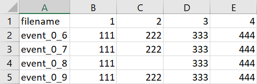
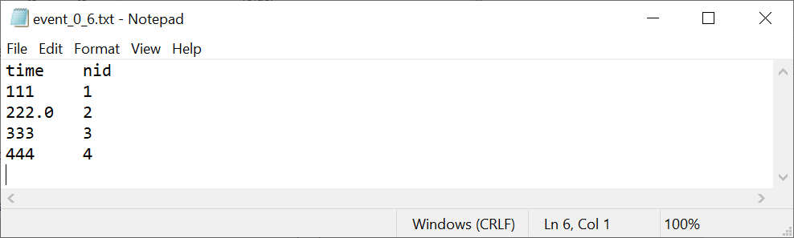

# ella-data-parser
This is a simple Python script in a Jupyter notebook that parses data from an Excel file and saves it into multiple text files.

### Input

### Process

Each row is saved as a text file named `<filename>.txt`. Each text file contains columns `time` and `nid` with the rest of the row data and its indices as its contents, respectively.

### Output

